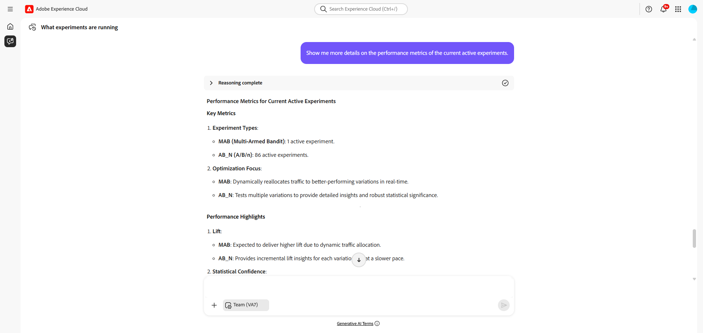

# Experimentatieagent

>[!AVAILABILITY]
>
>De Experimentation Agent is beschikbaar voor alle klanten die de betaalde licentie van Journey Optimizer Experimentation Accelerator hebben aangeschaft en kan naadloos worden geïntegreerd met Adobe Target of Adobe Journey Optimizer.
>
>[&#x200B; Leer meer op Journey Optimizer Experimentation Accelerator &#x200B;](https://experienceleague.adobe.com/nl/docs/experimentation-accelerator/using/overview)

## Overzicht

De **Agent van de Experimentatie** is een op AI-Gebaseerd hulpmiddel dat moderniseert hoe u digitale experimenten over websites, e-mails, duwberichten, en toepassingen in werking kunt stellen en beheren. Voortgebouwd op het platform van Adobe Experience Platform AI en experimenteeringshulpmiddelen, helpt de **Agent van de Experimentatie** u experimenten efficiënter in werking stellen, bedrijfsdoelstellingen organiseren, en actionable inzichten produceren, die benadrukken wat werkte, wat niet werkte, en waar volgende te experimenteren.

De volgende toestemmingen om de eigenschappen van de Agent van de Experimentatie volledig te gebruiken.

* **Experimenten van de Mening**: Deze toestemming laat u de Agent van de Experimentatie gebruiken om inzichten in het experiment direct in AI Medewerker te bekijken.

* **beheert Experiment Metada**: Deze toestemming laat u de Agent van de Experimentatie gebruiken om nieuwe experimenten direct in AI Medewerker tot stand te brengen.

➡️ [&#x200B; Leer meer in de documentatie van Journey Optimizer Experimentation Accelerator &#x200B;](https://experienceleague.adobe.com/nl/docs/experimentation-accelerator/using/get-started/experiment-accelerator-access)

Als onderdeel van de Experimentation Accelerator-functie levert de Agent:

* **Prestaties**: een duidelijke mening van wat in het experiment gebeurde

* **Inzichten**: een verklaring van waarom de resultaten voorkwamen

* **Kansen**: begeleiding op de volgende te nemen acties

## Gebruiksscenario’s

De Experimentation Agent verbetert elke fase van de testworkflow door resultaten te analyseren, inhoud te interpreteren en volgende stappen voor te stellen.

Zijn mogelijkheden kunnen in vijf zeer belangrijke functies worden gegroepeerd:

* **Experimentele Samenvatting**

  Geef een duidelijk, niet-technisch overzicht van de resultaten van experimenten voor de belanghebbenden.

* **Analyse van de Inhoud**

  Onderzoek het overseinen of creatieve elementen van behandelingen om te begrijpen waarom bepaalde degenen anderen overtroffen.

* **Identificatie van Attributen**

  Bewerkingen categoriseren op basis van hun belangrijkste kenmerken, bijvoorbeeld thema&#39;s, tonen, indelingen, en deze kenmerken koppelen aan omzettingsresultaten.

* **generatie van de Aanbeveling**

  Voorstellen van nieuwe behandelingen of aanpassingen om te testen op basis van inzichten uit eerdere experimenten.

* **Kansen**

  Omtrekbare gebieden of nieuwe hoeken voor experimenten identificeren om onbenut potentieel aan het licht te brengen.

## Functies binnen bereik en buiten bereik

### **in Toepassingsgebied**

De volgende mogelijkheden worden momenteel ondersteund:

* Prestaties
* Inzichten
* Kansen

### **uit Toepassingsgebied**

De volgende functies worden momenteel niet ondersteund:

* Experimenten maken of bewerken
* Het gebruiken van veelvoudige metriek voor het melden van gebruiksgevallen

## Voorbeeldvragen

Hier is een lijst van snelle steekproeven om u te helpen met de Agent van de Experimentatie beginnen:

### Algemene vragen

| Vragen |
|-|
| Welke experimenten worden uitgevoerd? |
| Welke experimenten worden uitgevoerd voor de `<campaign name>`? |
| Welke experimenten zijn de afgelopen maand begonnen? |
| Hoeveel experimenten zijn het afgelopen jaar geëindigd? |
| Welke experimenten worden momenteel gepauzeerd/gestopt/enzovoort? |
| Welke gangbare patronen komen uit recente tests naar voren? |
| Wat is de gemiddelde duur van experimenten in het laatste kwartaal? |

### Prestatievragen

| Vragen |
|-|
| Voor mijn `<experiment name>`, welke behandeling leidt? |
| Wat is de lift van de `<experiment name>` ? |
| Welke experimenten hadden statistisch significante resultaten? |
| Welke experimenten hadden de beste omrekeningskoers? |

### Inzichtsvragen

| Vragen |
|-|
| Wat is `<experiment name>` testen?? |
| Wat hebben we geleerd van de `<experiment name>` ? |
| Kan je me vertellen waarom behandeling A gewonnen heeft? |
| Welke thema&#39;s nemen toe bij winnende varianten? |
| Welke gangbare patronen komen uit recente tests naar voren? |
| Is er iets onverwachts gebeurd in `<experiment name>` ? |

### Opportuniteitsvragen

| Vragen |
|-|
| Wat raad je aan om na dit experiment te doen? |
| Is de enige manier om `<experiment name>` te verbeteren? |
| Welke mogelijkheden zijn er na `<experiment name>` duidelijker geworden? |
| Wat kan ik vervolgens testen om de hypothese uit `<experiment name>` te bewijzen? |
| Welke bijkomende gebruiksgevallen moet ik toepassen? |
