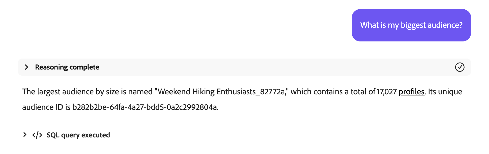

# Audience-agent

>[!AVAILABILITY]
>
>De Audience Agent is beschikbaar voor alle klanten die toegang hebben tot AI Assistant. U hebt echter de volgende machtigingen nodig om de Audience Agent-functies volledig te kunnen gebruiken.
>
>**Segmenten van de Mening**: Deze toestemming laat u Audience Agent gebruiken om inzichten in het publiek direct in AI Medewerker te bekijken.
>
>**beheert Segmenten**: Aan toestemming laat u Audience Agent gebruiken om nieuw publiek in AI Medewerker direct tot stand te brengen.

In de Audience Agent kunt u inzichten weergeven over het publiek, zoals het detecteren van belangrijke wijzigingen in de publieksgrootte, het detecteren van dubbele doelgroepen, het verkennen van uw publieksinventaris en het ophalen van de grootte van uw publiek.

>[!SLIDE](audience-agent-overview)

## Ondersteunde gebruiksgevallen

De Audience Agent in AI Assistant ondersteunt de volgende gebruiksgevallen:

- Gesprek uw publiek
   - Grootte van publiek zoeken voor bestaand publiek
   - Zoek naar soorten publiek op basis van volledige of gedeeltelijke benoemde kenmerken
   - Gedupliceerde doelgroepen detecteren
   - Ontdek XDM gebieden u kunt gebruiken om een publiek te bepalen
- Belangrijke wijzigingen in de grootte van het publiek vaststellen
   - Dit laat u publiek vinden dat plotseling is gegroeid of gekrompen, latend u potentiële marktveranderingen beter kunt analyseren
- Aanmaken van publiek
   - Met deze vaardigheid kunt u een publiek maken op basis van de opgegeven kenmerken en gebeurtenissen
   - Bovendien, laat deze vaardigheid u de potentiële grootte van een publiek schatten alvorens het publiek tot stand te brengen, latend u snel op het meest efficiënte publiek herhalen alvorens het klaar is om te activeren

<!-- - Find your audience size and detect significant changes in audience size
  - This lets you find audiences that have suddenly grown or shrunk, letting you better analyze potential market changes
- Detect duplicate audiences
  - This lets you reduce redundancies with your created audiences
- Find audiences based on full or partial attributes named
  - This lets you more easily navigate through your audience inventory
- Discover XDM fields you can use to define an audience
  - This skill lets you more easily identify the right fields to use in your audience based on context and relevance -->

Audience Agent steunt momenteel niet **&#x200B;**&#x200B;de volgende eigenschap:

- Goal-based publieksverkenning
   - Met doelgerichte publieksverkenning kunt u relevante datasets en profielen detecteren die zijn afgestemd op een zakelijk doel door modellen voor machinaal leren toe te passen, zoals de neiging om te kopen of om te zetten.

Wanneer u Audience Agent gebruikt, moet u bovendien rekening houden met de volgende beperkingen:

- Audience Agent heeft minstens 24 uur nodig om uw gegevens te verwerken
   - Bijvoorbeeld, kunt u **niet** een vraag hebben die gegevens binnen de laatste 24 uren zoekt. Je moet minimaal binnen de laatste 48 uur kijken.
- Audience Agent ondersteunt alleen de volgende soorten publiek:
   - **Op mensen-gebaseerde** publiek dat gebruikend partijsegmentatie wordt geëvalueerd
   - **op rekening-gebaseerde** publiek voor de volgende gebruiksgevallen:
      - Gesprek voor publiek
      - Detectie van publiek dupliceren

## Voorbeeldaanwijzingen

In de volgende voorbeelden worden voorbeeldaanwijzingen en reacties voor de Audience Agent getoond.

### Gesprek voor publiek

Geef me velden weer voor rijke kopers.

+++ Antwoord


+++

Welk publiek is in de afgelopen 30 dagen niet geactiveerd of gebruikt in een campagne?

+++ Antwoord


+++

Geef een overzicht van alle soorten publiek die in de afgelopen drie maanden zijn toegewezen aan nieuwe doelen.

+++ Antwoord


+++

Welk publiek van de rekening heeft de grootste publieksgrootte en wat is die grootte?

+++ Antwoord


+++

### Gedupliceerde doelgroepen detecteren

Heb ik een publiek met identieke of vergelijkbare beschrijvingen?

+++ Antwoord


+++

Identificeer publiek dat de zelfde regels maar verschillende namen heeft.

+++ Antwoord


+++

Toon me alle publiek dat de zelfde regels maar verschillende activeringsbestemmingen heeft.

+++ Antwoord


+++

Accountsoorten identificeren die dezelfde regels hebben maar andere namen hebben.

+++ Antwoord


+++

### Grootte publiek ophalen

Wat is de huidige grootte van mijn publiek &quot;Gold-star members in California_f153e1&quot;?

+++ Antwoord


+++

Wat is mijn grootste publiek?

+++ Antwoord



+++

### Belangrijke wijzigingen in de grootte van het publiek vaststellen

Welk publiek is de afgelopen week met meer dan 20% toegenomen?

+++ Antwoord


+++

Welk publiek is de afgelopen maand met meer dan 10% kleiner geworden?

+++ Antwoord


+++

Wat is mijn snelst groeiende publiek?

+++ Antwoord


+++

### Een publiek maken

>[!AVAILABILITY]
>
>U kunt de vaardigheid van het publiek alleen gebruiken als u deel uitmaakt van het Agent Orchestrator Explorer-programma. Neem voor meer informatie contact op met de klantenservice van Adobe.

Wanneer u een publiek maakt met Audience Agent, begeleidt AI Assistant u door een abonnement. U kunt bijvoorbeeld vragen &quot;Een publiek maken dat bestaat uit mensen die in Californië wonen&quot;. AI Assistant geeft vervolgens het plan weer dat de assistent zal gebruiken om het publiek te maken.

+++ Antwoord


+++

Dit plan bestaat uit drie stappen:

1. [Identificeer publiekskenmerken](#identify)
2. [Grootte publiek schatten](#estimate)
3. [Een nieuw publiek maken en behouden](#create)

#### Identificeer publiekskenmerken {#identify}

{align="center" width="80%"}

Na het goedkeuren van het plan, zal de Medewerker van AI de eigenschappen halen van het publiek die van uw aanvankelijke vraag worden gebaseerd.

+++ Antwoord


Voor deze query genereert AI Assistant de relevante Profile Query Language (PQL) die zoekt naar mensen die in Californië wonen. In dit geval ziet de PQL-query er als volgt uit:

```sql
homeAddress.state.equals("California", false)
```

Voor meer informatie over PQL, lees het [&#x200B; overzicht van PQL &#x200B;](https://experienceleague.adobe.com/en/docs/experience-platform/segmentation/pql/overview).

+++

Als de publieksdefinitie van de AI Medewerker correct is, kunt u goedkeuren en zich aan de volgende stap bewegen.

#### Grootte publiek schatten {#estimate}

{align="center" width="80%"}

Na goedkeuring van de geïdentificeerde publiekskenmerken, zal AI Assistant de grootte van het potentiële publiek en de publieksdefinitiedetails schatten.

+++ Antwoord


+++

Als de geschatte grootte er goed uitziet, kunt u de volgende stap goedkeuren en doorlopen.

#### Nieuw publiek maken en behouden {#create}

{align="center" width="80%"}

Tot slot als de kenmerken en de publieksgrootte correct kijken, kunt u de verwezenlijking van het publiek goedkeuren of verwerpen.

+++ Antwoord

Eerst, kunt u het voorgestelde publiek door het verstrekte gegevensnet herzien.


Als het publiek er goed uitziet, kunt u het voorstel accepteren door **[!UICONTROL Create]** te selecteren om het maken van het publiek te voltooien.


+++

Het publiek is nu aangemaakt.

{align="center" width="80%"}

## Volgende stappen

Nadat u deze handleiding hebt gelezen, hebt u beter inzicht in Audience Agent en de functies die deze ondersteunt. Voor meer informatie over agenten in Adobe Experience Platform, lees het [&#x200B; overzicht van Agent Orchestrator &#x200B;](./agent-orchestrator.md).

