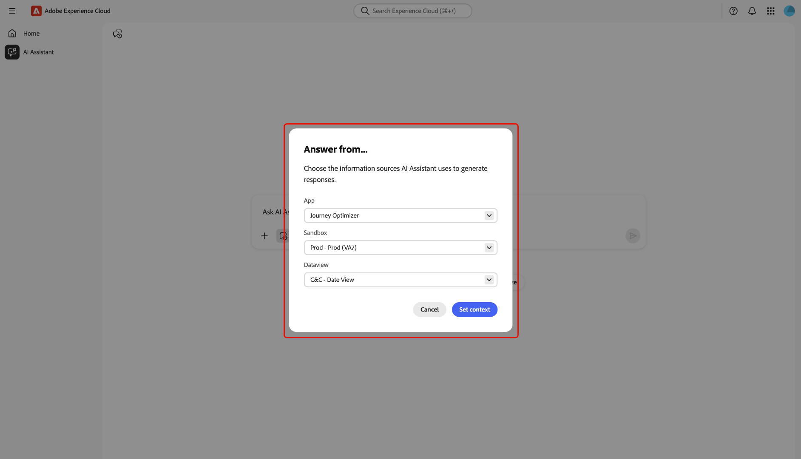

# AI-assistent

AI Assistant is een intelligent, converationeel en generatief AI-programma dat de productiviteit verhoogt en het werk in op Adobe Experience Platform gebaseerde toepassingen opnieuw definieert. Met AI Assistant hebt u toegang tot Adobe Experience Platform Agents en andere AI-functies.

Lees deze handleiding voor meer informatie over het gebruik van AI Assistant.

## AI-assistent openen

Er zijn verschillende manieren om toegang te krijgen tot AI Assistant.

Selecteer in de Experience Cloud-thuisinterface **[!UICONTROL AI Assistant]** in de linkernavigatie om de AI Assistant-weergave voor volledig scherm te starten.

+++Selecteren voor weergave

+++

U kunt AI Assistant ook starten vanaf de homepages van Experience Cloud-toepassingen, zoals Experience Platform, Adobe Journey Optimizer en Customer Journey Analytics. Navigeer aan uw product homepage en selecteer dan het **AI Hulppictogram** van de hoogste kopbal om het AI Hulp praatjepaneel op het juiste spoor te lanceren.

+++Selecteren voor weergave

+++

## Navigeren in de gebruikersinterface van de AI Assistant

Lees deze sectie om te leren hoe u de AI Hulp interface kunt navigeren.

### Volledige schermweergave

De interface AI Assistant bevat verschillende belangrijke elementen waarmee u effectief kunt werken:

1. **[!UICONTROL Conversations]**: Selecteer het pictogram **[!UICONTROL Conversations]** om een nieuw gesprek te beginnen en recente gesprekken vanuit uw geschiedenis te openen. Voor meer informatie, lees de sectie over [ gesprekken ](#conversations).
2. **doos van de Input**: Selecteer de inputdoos om vragen en herinneringen voor AI Medewerker in te gaan. Voor meer informatie, lees de sectie over [ inputeigenschappen ](#input-features).
3. **Gegevens en objecten autocomplete**: - selecteer het plus pictogram om gegevens en objecten suggestie en autocomplete te gebruiken. Als deze optie is geselecteerd, kunt u een pop-upvenster gebruiken om voorgestelde entiteiten te selecteren. Voor meer informatie, lees de sectie over [ gegevens en objecten autocomplete ](#autocomplete).
4. **Context die** plaatst: - selecteer het Context die pictogram plaatst om informatiebronnen voor AI Medewerker te vormen. Met dit gereedschap kunt u de toepassing, sandbox en gegevensweergave configureren waarnaar wordt verwezen in de AI-assistent om uw query te beantwoorden. Voor meer informatie, lees de sectie over [ context die ](#context-setting) plaatst.
5. **Ontdekking**: - selecteer **[!UICONTROL Learn]**, **[!UICONTROL Analyze]**, en **[!UICONTROL Optimize]** om steekproefvragen te bekijken die u kunt gebruiken om begonnen te worden. Voor meer informatie, lees de sectie over [ ontdekkingsherinneringen ](#discoverability-prompts).

### Spoorstaafweergave

De spoormening verleent snelle toegang tot praatje, ontdekkingsherinneringen, updates, gesprekken, en interfacecontroles in een compact paneel.

1. **[!UICONTROL Chat]**: selecteer **[!UICONTROL Chat]** in de koptekst om terug te keren naar uw gesprek in het geval dat u de toegang tot verschillende elementen in de interface hebt verlaten.
2. **[!UICONTROL Discovery]**: selecteer **[!UICONTROL Discovery]** om een lijst weer te geven met instructies voor AI Assistant, ingedeeld op categorie. U kunt deze vooraf geconfigureerde aanwijzingen gebruiken om uw chat te vullen. Bovendien kunt u de voorgestelde aanwijzingen aanpassen om aan uw specifieke gebruiksscenario te voldoen.
3. **[!UICONTROL What's New]**: selecteer **[!UICONTROL What's New]** om een lijst weer te geven met de meest recente updates die beschikbaar zijn voor AI Assistant.
4. **[!UICONTROL Conversations]**: Selecteer het pictogram **[!UICONTROL Conversations]** om een nieuw gesprek te beginnen en recente gesprekken vanuit uw geschiedenis te openen. Voor meer informatie, lees de sectie over [ gesprekken ](#conversations).
5. **Volledige het schermmening**: Selecteer het **[!UICONTROL Full screen view]** pictogram om uw interface van AI Hulp van het juiste spoor in het volledige schermwijze te veranderen.
6. **Gegevens en objecten autocomplete**: Selecteer het plus pictogram om gegevens en objecten suggestie en autocomplete te gebruiken. Als deze optie is geselecteerd, kunt u een pop-upvenster gebruiken om voorgestelde entiteiten te selecteren. Voor meer informatie, lees de sectie over [ gegevens en objecten autocomplete ](#autocomplete).
7. **Context die** plaatst: Selecteer het Context die pictogram plaatsen om informatiebronnen voor AI Medewerker te vormen. Met dit gereedschap kunt u de toepassing, sandbox en gegevensweergave configureren waarnaar wordt verwezen in de AI-assistent om uw query te beantwoorden. Voor meer informatie, lees de sectie over [ context die ](#context-setting) plaatst.

## Handleiding voor AI Assistant-gebruikersinterface

Dit gedeelte bevat een overzicht van de belangrijkste functies en navigatieopties in de gebruikersinterface van de AI Assistant. Het verklaart hoe te om tot AI Medewerker toegang te hebben, beschrijft de lay-out en de controles in zowel het volledige scherm als spoormeningen, en introduceert zeer belangrijke hulpmiddelen zoals gesprekken, inputeigenschappen, autocomplete, context plaatsend, en ontdekkingsherinneringen. In de volgende secties vindt u gedetailleerde informatie over het gebruik van deze functies voor interactie met AI Assistant en over het optimaal benutten van uw ervaring.

### Detectieverzoeken

U kunt de de ontdekkingseigenschap van AI Medewerker gebruiken om een lijst van de algemene onderwerpen te bekijken, die in entiteiten worden gegroepeerd, die AI Medewerker steunt. De zoekvragen zijn afhankelijk van het beginpunt.

>[!BEGINTABS]

>[!TAB  ontdekking van het Gebruik van de volledige het schermmening ]

In de volledige schermweergave worden de detectieverzoeken gegroepeerd in drie categorieën: **[!UICONTROL Learn]**, **[!UICONTROL Analyze]** en **[!UICONTROL Optimize]** .

Als u detectieverzoeken wilt gebruiken om productkennis te verbeteren, selecteert u **[!UICONTROL Learn]** en selecteert u vervolgens een vraag in het vervolgkeuzevenster dat wordt weergegeven.

>[!TAB  ontdekken van het Gebruik van de spoormening ]

Selecteer **[!UICONTROL Discovery]** in de rasterweergave voor toegang tot een uitgebreide lijst met zoekinstructies die u kunt gebruiken om aan de slag te gaan en uw chat te vullen met AI Assistant.

>[!ENDTABS]

Selecteer een vraag om het invoervak te vullen. Van hier, kunt u de herinnering uitgeven om uw bepaald gebruiksgeval te passen. Wanneer klaar, selecteer het verzendpictogram op het recht om uw vraag voor te leggen.

## Interactie met reacties

### Controleren op redeneringsproces {#reasoning}

AI Assistant zoekt vervolgens naar zijn kennisbasis en berekent een antwoord. Na een paar ogenblikken, keert AI Medewerker een antwoord, met inbegrip van opties terug om dieper in zijn het redeneren proces, verwante suggesties, informatiebronnen, en terugkoppelt hulpmiddelen te duiken.

Selecteer **[!UICONTROL Reasoning complete]** als u het onderliggende redeneringsproces beter wilt begrijpen.

Het venster *[!UICONTROL Reasoning complete]* wordt uitgebreid om een overzicht van uw verzoek en details over te tonen hoe de reactie werd gecreeerd.

### Verwante suggesties gebruiken

Navigeer vervolgens omlaag naar de onderkant van de reactie en selecteer **[!UICONTROL Related suggestions]** om een lijst met vragen te ontvangen die betrekking hebben op de eerste query. U kunt deze herinneringen gebruiken om uw gesprek met AI Medewerker verder voort te zetten.

### Bronnen weergeven

Als u het antwoord van AI Assistant wilt controleren, selecteert u **[!UICONTROL Sources]** om een lijst weer te geven met informatiebronnen waarnaar AI Assistant verwijst bij het berekenen van het antwoord.

### Feedback geven

U kunt feedback over uw ervaringen met AI Assistant opgeven met de opties die bij het antwoord worden geleverd.

Als u feedback wilt geven, selecteert u duimen omhoog of duimen omlaag na ontvangst van een reactie van AI Assistant en voert u uw feedback in het tekstvak in.

>[!BEGINTABS]

>[!TAB  duimen omhoog ]

Selecteer **[!UICONTROL Thumbs up]** om positieve feedback te geven. U kunt desgewenst een keuze maken in een lijst met positieve feedback of het invoervak gebruiken om uw eigen specifieke feedback in te voeren.

+++Selecteren voor weergave

U kunt ook **[!UICONTROL Detailed feedback]** selecteren om verder op uw feedback in te gaan. Selecteer **[!UICONTROL Submit]** als u klaar bent.

+++

>[!TAB  duimen neer ]

Selecteer **[!UICONTROL Thumbs down]** om constructieve feedback te geven. U kunt desgewenst een keuze maken in een lijst met constructieve feedback of het invoervak gebruiken om uw eigen specifieke feedback in te voeren.

+++Selecteren voor weergave

Op dezelfde manier kunt u ook **[!UICONTROL Detailed feedback]** selecteren om verder op uw feedback in te gaan. Selecteer **[!UICONTROL Submit]** als u klaar bent.

+++

>[!ENDTABS]

### De functie voor gesplitste weergave gebruiken

Als de reactie van AI Assistant een afbeelding bevat, kunt u het padpictogram selecteren om een modus voor gesplitste weergave te starten. Op deze manier kunt u het volledige antwoord van AI Assistant lezen en aan de rechterkant een contextafhankelijke afbeelding weergeven.

### Gesprek

U kunt het deelvenster *[!UICONTROL All conversations]* gebruiken om gesprekken met AI Assistant opnieuw in te stellen en te bekijken. Selecteer het pictogram **[!UICONTROL Conversations]** om het *[!UICONTROL All conversations]* -venster weer te geven.

Om een vorig gesprek opnieuw te bekijken, selecteer het gespreksonderwerp van de verstrekte lijst.

Selecteer **[!UICONTROL New conversation]** om een nieuw gesprek te starten.

### Context-instelling {#context-setting}

Gebruik de context het plaatsen eigenschap van AI Medewerker om de **toepassing** te vormen, **zandbak**, en **dataview** die AI Hulpverwijzingen om uw vraag te beantwoorden. Als u context-instelling wilt openen, selecteert u het pictogram **[!UICONTROL Context setting]** in het invoervak.

Het pop-upvenster *[!UICONTROL Answer from...]* wordt weergegeven. In dit venster kunt u de informatiebronnen configureren die u wilt gebruiken en vervolgens **[!UICONTROL Set context]** selecteren.

| Informatiebron | Beschrijving | Voorbeelden |
| --- | --- | --- |
| App | De Experience Cloud-toepassing waarop uw query betrekking heeft. | Experience Platform, Journey Optimizer, Customer Journey Analytics, enz. |
| Sandbox | De sandbox die de gegevensset(s) of informatie bevat waarop uw query betrekking heeft. | Prod (VA7), dev. |
| Gegevensweergave | Als u AI Assistant gebruikt met Customer Journey Analytics, helpt de instelling van de gegevensweergave de Data Insights Agent te begrijpen: <ul><li>Welke datasets moeten worden gecontroleerd</li><li>Welke gegevenscomponenten beschikbaar zijn</li><li>Hoe te om reacties over uw gegevens te structureren</li><li>Welke visualisaties moeten worden gemaakt in Analysis Workspace</li></ul> |

### Automatisch aanvullen van gegevens en objecten

Met de functie Automatisch aanvullen kunt u een lijst met gegevensobjecten ontvangen die in uw sandbox staan. Als u Automatisch aanvullen wilt gebruiken, voert u het plusteken (+) in de query in. U kunt ook het plusteken (+) onder aan het tekstinvoervak selecteren. Er wordt een venster weergegeven met een lijst met aanbevolen gegevensobjecten uit uw sandbox.

### Reacties verifiëren

Er zijn een aantal manieren waarop u reacties van AI Assistant kunt verifiëren. Selecteer **[!UICONTROL Query Term Matched to Objects]** om een overzicht van de termijnen in uw vraag te bekijken die aan specifieke voorwerpen in uw organisatie werden aangepast.

Selecteer **[!UICONTROL Here is how I got the results]** om een gedetailleerde, geleidelijke uitleg te zien van hoe AI Assistant het antwoord heeft gekregen. Bovendien kunt u ook de SQL-query bekijken die is uitgevoerd om uw vraag te beantwoorden. Deze query is alleen-lezen en wordt niet ondersteund voor gebruik in Query Service.

### Gegevensvisualisatie configureren

U kunt de mogelijkheden van de gegevensvisualisatie van AI Assistant gebruiken om een beter inzicht in uw gegevens te krijgen. U kunt ook het type grafiek opgeven dat u in de query wilt gebruiken. Bijvoorbeeld, leg een vraag voor die zegt: **&quot;toon winst door productnaam voor vorige maand (bar)&quot;** om een bar grafiek van winst in de laatste maand te ontvangen, die door productnaam wordt georganiseerd.

 wordt getoond

Selecteer vervolgens **[!UICONTROL Properties]** om het grafiektype te wijzigen en waarden voor uw X- en Y-as te configureren.

AI Assistant ondersteunt verschillende grafiektypen voor gegevensvisualisatie. U kunt met alle soorten grafiek in wisselwerking staan door over de gegevens te hangen.

>[!BEGINTABS]

>[!TAB  Lijn ]

Selecteer **[!UICONTROL Properties]** en selecteer **[!UICONTROL Line]** om een lijngrafiek weer te geven.

>[!TAB  Gebied ]

Als u een vlakgrafiek wilt weergeven, selecteert u **[!UICONTROL Properties]** en selecteert u vervolgens **[!UICONTROL Area]** .

>[!TAB  Spreiding ]

Als u een spreidingsgrafiek wilt weergeven, selecteert u **[!UICONTROL Properties]** en selecteert u vervolgens **[!UICONTROL Scatter]** .

>[!TAB  Donut ]

Als u een donutgrafiek wilt weergeven, selecteert u **[!UICONTROL Properties]** en selecteert u vervolgens **[!UICONTROL Donut]** .

>[!ENDTABS]